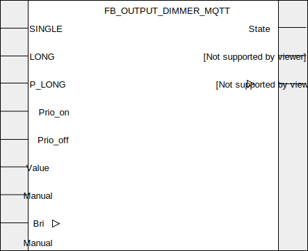

## FB_OUTPUT_DIMMER_MQTT

### **General**

Can be controlled using pulses from [FB_INPUT_PUSHBUTTON_MQTT](./FB_INPUT_PUSHBUTTON_MQTT.md), maintains output state through powercycles. Or by MQTT messages (8bit / byte 0-255) to set a `brightness` or a `state` (on or off). Internally the brightness is a word datatype ( 16bit / 0-65535) and can clipped to a lower and upper bound and corrected by 4 different curves.

### **Curves**

Some leds and some dimmers work with different curves. Not all led or dimmers are linear. The dimmer can be configured to use one of the following curves:


All these non-linear curves help to have more control near full brightness and decrease the control near 0. This allows you to finetune more easily the brightness of your leds near full output.

### **Block diagram**



INPUT(S)

- SINGLE: input to connect to one or multiple `SINGLE` from one or multiple [FB_INPUT_PUSHBUTTON_MQTT](./FB_INPUT_PUSHBUTTON_MQTT.md).
- LONG: input to connect to one or multiple `LONG` from one or multiple [FB_INPUT_PUSHBUTTON_MQTT](./FB_INPUT_PUSHBUTTON_MQTT.md).
- P_LONG: input to connect to one or multiple `P_LONG` from one or multiple [FB_INPUT_PUSHBUTTON_MQTT](./FB_INPUT_PUSHBUTTON_MQTT.md).
- Prio_on: when high the output `State` is set to on with a maximum `Brightness`, has priority over the other inputs.
- Prio_off: when high the output `State` is set to low, has priority over the other inputs.
- Value: byte value for Manual operation.
- Manual: Flag to allow 'value' as input, rather than internal dimm
- RST: Resets the light back to off (and bri 0)

OUTPUT(S)

- State: output, bool datatype.
- Bri: dimmer value, word datatype.
- State_Bri: follows `Bri` when `State` is high. Equal to 0 when `State` is low.

METHOD(S)

- InitMQTT: enables MQTT events on the FB, an overview of the parameters:

  - `MQTTPublishPrefix`: datatype _POINTER TO STRING_, pointer to the MQTT publish prefix that should be used for publishing any messages/events for this FB. Suffix is automatically set to FB name.
  - `MQTTSubscribePrefix`: datatype _POINTER TO STRING_, pointer to the MQTT subscribe prefix that should be used for publishing any messages/events to this FB. Suffix is automatically set to FB name.
  - `pMqttPublishQueue`: datatype _POINTER TO FB_MqttPublishQueue_, pointer to the MQTT queue to publish messages.
  - `OutputDimmer`: datatype _BOOL_, specify whether the DIM values (0-255) should be outputted as MQTT events.
  - `Qos_Dimm`: datatype _SD_MQTT.QoS_, MQTT QoS of the DIM MQTT events.
  - `Delta_Dimm`: datatype _INT_, resolution of the MQTT Bri events. For example: specifying value _5_ will configure the FB to only emit an MQTT event when the Bri output differs _5_ or more than its previous value. Note that the last value of output Bri (when input `P_LONG` becomes low again) is always published. Even if the resolution delta hasn't been reached yet. This way the last Bri value published through MQTT is always synchronized with the Bri output of the FB.

- ConfigureFunctionBlock: configures the dimmer with your prefered configurations, an overview of the parameters and their default values.

  - `Limit_lower`: datatype _WORD_, This clips the dimmer to a lower value, default = 65535;
  - `Limit_upper`: datatype _WORD_, This clips the dimmer to a upper value, default = 65535;
  - `Soft_Dimm`: datatype _BOOL_, Dimm soft when turned off and on, default = TRUE;
  - `Rst_Bri`: datatype _BOOL_, When reset, also resets Brightness, default = FALSE;
  - `Mqtt_on_startup`: datatype _BOOL_, MQTT on startup, default = TRUE;
  - `Mqtt_send_out`: datatype _BOOL_, Send out MQTT, default = TRUE;
  - `Time_to_ramp`: datatype _TIME_, Time to ramp from 0 to full, default = TIME#3S0MS;
  - `Dimm_curve`: datatype _DINT_, Dimmer curves, default = DIMMER_CURVE.quadratic;
  - `Blink_enabled`: datatype _BOOL_, Enable a blink at top or bottom of curve, default = TRUE;
  - `Wait_at_top_time`: datatype _TIME_, Time to wait at top or bottom of curve before and after blink, default = TIME#0S150MS;
  - `Blink_time`: datatype _TIME_, Time to blink , default = TIME#0S40MS;
  - `Blink_value_top_percentage`: datatype _BYTE_, % of brightness in inside clipped and curved range at top, default = 80;
  - `Blink_value_bottom_percentage`: datatype _BYTE_, % of brightness in inside clipped and curved range at bottom, default = 20;

- PublishReceived: callback method called by the callbackcollector when a message is received on the subscribed topic by the callbackcollector.

- initDMX: configures the dimmer with DMX configuration. For more info about Art-Net and DMX [read this](./../AdditionalFunctionality/DMX_artnet.md)
  - `DmxChannel`: Which channel 1-256. (not 0)
  - `DmxWidth`: Width of the channel, in channels. (often 1 or 2)
  - `pDmxValues`: datatype _POINTER TO oscat_network.NETWORK_BUFFER_SHORT_, pointer to a global buffer. There is now only one buffer, thus one universe
  - `dmxUniverse`: Integer value of the universe. Meta data for MQTT only.

  
- InitMqttDiscovery:  
    - See [MQTT Discovery](./../AdditionalFunctionality/MQTT_Discovery.md) for more info.

### **Function Block Behaviour**

The following table shows the operating status of the dimmer:

| Event       | Brightness | DIR (\*)  | Bri                                                                                                                       | State_Bri |
| :---------- | :--------- | :-------- | :------------------------------------------------------------------------------------------------------------------------ | :-------- |
| SINGLE      | Alternate  | Bri < 1/2 | LIMIT(MIN_ON,OUT,MAX_ON)                                                                                                  | Q \* Bri  |
| LONG/P_LONG | On         | Alternate | Ramp up or down depending on DIR, start at 0 when soft_dimm, and state is off, reverse direction if min or max is reached | Bri       |
| Manual      | On         | -         | Value                                                                                                                     | Bri       |
| Reset       | Off        | -         | 0 when RST_OUT = TRUE                                                                                                     | 0         |

(\*): DIR refers to the direction of the dimmer output `Bri`, indicating whether the dimmer output value changes up-or downwards.

### **MQTT Event Behaviour**

Requires method call `InitMQTT` to enable MQTT capabilities. Note that these MQTT message don't follow the curve of the dimmer, but are linear.

Typical publish topic for this function block are

- `Devices/PLC/House/Out/Dimmers/FB_AO_DIMMER_001` (TRUE/FALSE)
- `Devices/PLC/House/Out/Dimmers/FB_AO_DIMMER_001/Bri` (0-255).

| Event                          | Description                                  | MQTT payload | QoS                                  | Retain flag | Published on startup |
| :----------------------------- | :------------------------------------------- | :----------- | :----------------------------------- | :---------- | :------------------- |
| **Output changes: State**      | A change is detected on output `State`. (\*) | `TRUE/FALSE` | 2                                    | `TRUE`      | no                   |
| **Output changes: brightness** | A change is detected on output `OUT`. (\*)   | `0-255`      | configured in method call `InitMQTT` | `TRUE`      | no                   |

(\*): MQTT publish topic is a concatenation of the publish prefix variable, the function block name and the name of the output.

### **MQTT Subscription Behaviour**

Typical subscription topic for this function block are

- `Devices/PLC/House/In/Dimmers/FB_AO_DIMMER_001` (TRUE/FALSE)
- `Devices/PLC/House/In/Dimmers/FB_AO_DIMMER_001/Bri` (0-255).

Requires method call `InitMQTT` to enable MQTT capabilities.
Commands are executed by the FB if the topic `MQTTSubscribeTopic` matches the MQTT topic and the payload exists in the table below.

| Command                       | Description                                          | expected payload |
| :---------------------------- | :--------------------------------------------------- | :--------------- |
| **Change output State to on** | Request to turn on the light.                        | `TRUE`           |
| **Change output Q to low**    | Request to turn off the light                        | `FALSE`          |
| **Set Bri byte value**        | Request to set the byte value on input/output `BRI`. | `0-255`          |

MQTT subscription topic is a concatenation of the subscribe prefix variable and the function block name.
Note that the function block also accepts float values for setting the dimmer output value, the float value will get rounded to the nearest integer value.

### **Code example**

- variables initiation:

```pascal
MqttPubDimmerPrefix			:STRING(100) := 'Devices/PLC/House/Out/Dimmers/';
MqttSubDimmerPrefix			:STRING(100) := 'Devices/PLC/House/In/Dimmers/';
FB_AO_DIMMER_001			:FB_OUTPUT_DIMMER_MQTT;
```

- Init MQTT method call (called once during startup):

  ```pascal
  FB_AO_DIMMER_001.InitMQTT(MQTTPublishPrefix:= ADR(MqttPubDimmerPrefix),     (* pointer to string prefix for the MQTT publish topic *)
      MQTTSubscribePrefix:= ADR(MqttSubDimmerPrefix),                         (* pointer to string prefix for the MQTT subscribe topic *)
      pMQTTPublishQueue := ADR(MQTTVariables.fbMQTTPublishQueue),             (* pointer to MQTTPublishQueue to send a new MQTT event *)
      pMqttCallbackCollector := ADR(MqttVariables.collector_FB_DIMMER_MQTT),  (* pointer to CallbackCollector to receive Mqtt subscription events *)
      TRUE,                                                                   (* specify whether dimmer value should be outputted on MQTT topic *)
      SD_MQTT.QoS.ExactlyOnce,                                                (* specify the QoS for the dimmer mqtt events (values 0-255) *)
      5                                                                       (* specify the resolution for the dimmer mqtt events *)
  );
  ```

  The MQTT publish topic in this code example will be `Devices/PLC/House/Out/Dimmers/FB_AO_DIMMER_001` (MQTTPubSwitchPrefix variable + function block name). The subscription topic will be `Devices/PLC/House/In/Dimmers/FB_AO_DIMMER_001/#` (MQTTSubSwitchPrefix variable + function block name + wildcard).

- ConfigureFunctionBlock (called once during startup):
  Notice the all have a default value, so you can leave out the ones you don't want to change.

  ```pascal
  FB_AO_DIMMER_001.ConfigureFunctionBlock(
    Limit_lower := 11000, 					// This clips the dimmer to a lower value
    Limit_upper := 65535, 				// This clips the dimmer to a upper value
    Soft_Dimm := TRUE,					// Dimm soft when turned off and on
    Rst_Bri := FALSE, 					// When reset, also resets Brightness
    Mqtt_on_startup := TRUE, 				// MQTT on startup
    Mqtt_send_out := TRUE, 				// Send out MQTT
    Time_to_ramp := TIME#3S0MS,			// Time to ramp from 0 to full
    Dimm_curve := DIMMER_CURVE.quadratic,// Dimmer curves
    Blink_enabled := TRUE,				// Enable a blink at top or bottom of curve
    Wait_at_top_time := TIME#0S150MS, 	// Time to wait at top or bottom of curve before and after blink
    Blink_time := TIME#0S40MS, 			// Time to blink
    Blink_value_top_percentage := 80, 	// % of brightness in inside clipped and curved range at top
    Blink_value_bottom_percentage := 20, 	// % of brightness in inside clipped and curved range at bottom
  );
  ```

  The dimmer behavior in the example above is adjusted to start dimming from '11000' instead of the default '0' value. This can be important as different dimming devices will have different lower bound 'on' voltages. In addition, depending on your PLC device, the maximum out value will differ. Note that this method only requires a call when it's desired to change the default behavior characteristics.

- checking for events to switch the digital output (cyclic), example 1:

```pascal
FB_AO_DIMMER_001(SINGLE:=   FB_DI_PB_041.SINGLE,    (* for toggling the output Q *)
    LONG:=                  FB_DI_PB_041.LONG,      (* for controlling the dimmer output Bri *)
    P_LONG:=                FB_DI_PB_041.P_LONG,    (* for controlling the dimmer output Bri *)
    Q=>                     DO_001,                 (* couple the function block to the physical digital output *)
    OUT:=                   AO_001,                 (* couple the function block to the physical anolog output *)
    VAL:=                   255,                    (* value to set on output Bri when input SET is high *)
    SET:=                   FB_DI_PB_041.DOUBLE     (* when high, VAL is set on output Bri *)
);
```

The above illustrates an integration with [FB_INPUT_PUSHBUTTON_MQTT](./FB_INPUT_PUSHBUTTON_MQTT.md). The dimmer module in this example has a 'on/off' digital input that is wired to the 'Q' output of the dimmer & a 0/1-10V analog input that is wired to the 'OUT' output of the dimmer.

- checking for events to switch the digital output (cyclic), example 2:

```pascal
FB_AO_DIMMER_001(
		SINGLE:=FB_DI_PB_003.SINGLE OR FB_DI_PB_008.SINGLE,
		LONG:=FB_DI_PB_003.LONG OR FB_DI_PB_008.LONG,
		P_LONG:=FB_DI_PB_003.P_LONG OR FB_DI_PB_008.P_LONG,
		manual:=  FB_DI_PB_003.DOUBLE OR FB_DI_PB_008.DOUBLE,
		value:=255
);
```

The above illustrates an integration with [FB_INPUT_PUSHBUTTON_MQTT](./FB_INPUT_PUSHBUTTON_MQTT.md). The dimmer module in this example has a 0/1-10V analog input that is wired to the 'Q_OUT' output of the dimmer.

```pascal
FB_AO_DMX_DIMMER_001.InitDmx(
    DmxChannel := 1,
    DmxWidth:=1,
    pDmxValues := ADR(DMXVariables.DMX.BUFFER)
    dmxUniverse := 1,
);
```

The above illustrates how to initiate dmx capabilities. If `InitDmx` is before `InitMqttDiscovery`, the config json in MQTT also contains the dmx channel, width and universe.

## **Home Assistant Auto discovery**

See [MQTT Auto discovery](../MQTT_Auto_Discovery/README.md) for more information.

### __Home Assistant YAML__
If home asistant auto discovery is not working for you, you can use the YAML code below in your [MQTT lights](https://www.home-assistant.io/components/light.mqtt/) config:

```YAML
mqtt:
  light:
  - name: "FB_AO_DIM_001"
    state_topic: "Devices/PLC/House/Out/Dimmers/FB_AO_DIMMER_001/Q"
    command_topic: "Devices/PLC/House/In/Dimmers/FB_AO_DIMMER_001"
    brightness_command_topic: "Devices/PLC/House/In/Dimmers/FB_AO_DIMMER_001"
    brightness_scale: 255
    brightness_state_topic: "Devices/PLC/House/Out/Dimmers/FB_AO_DIMMER_001/OUT"
    on_command_type: "last"
    payload_on: "TRUE"
    payload_off: "FALSE"
    qos: 2
    optimistic: false
    availability_topic: "Devices/PLC/House/availability"
    payload_available: "online"
    payload_not_available: "offline"
```
